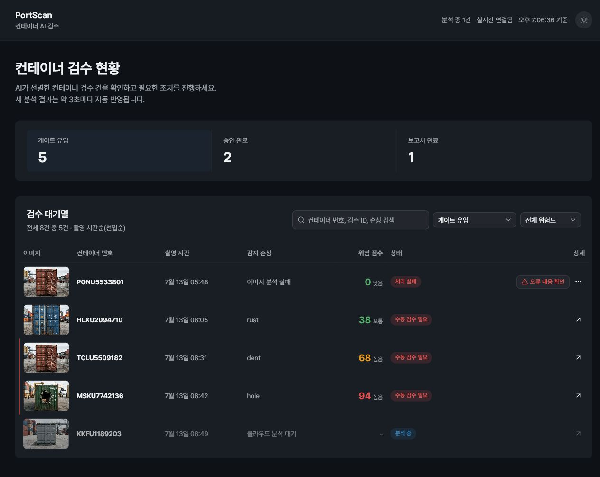
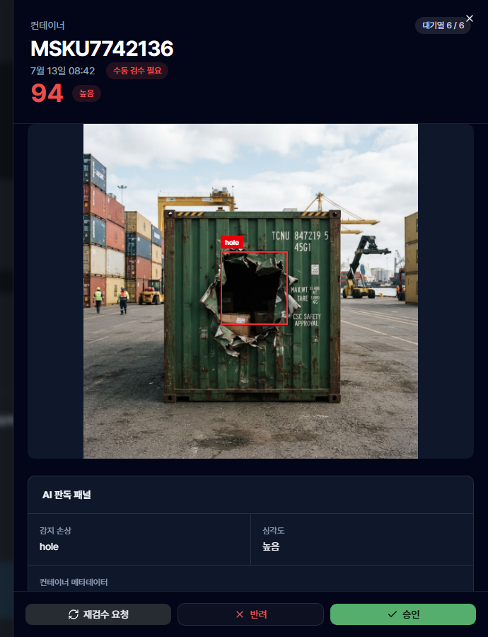
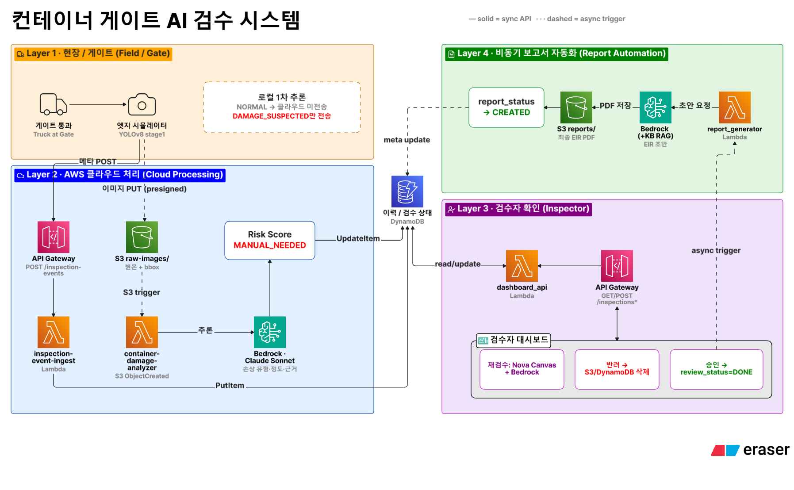

# Container Damage Inspection

컨테이너 반출입 과정에서는 촬영된 이미지를 사람이 직접 확인하고 손상 여부를 판단한 뒤, 검사 결과를 다시 기록하고 보고서로 작성해야 합니다. 이 과정에서 많은 이미지를 반복해서 확인해야 하고, 이미지·판정 결과·보고서가 따로 관리되기 쉽다는 점에 주목했습니다.

저희 팀은 **AI가 1차로 검사 대상을 줄이고, 클라우드에서 상세 분석한 결과를 사람이 최종 확인한 뒤 보고서까지 자동으로 생성하는 흐름**을 하나의 시스템으로 구현하고자 했습니다.

게이트에서 촬영된 이미지는 Edge YOLO가 먼저 손상 의심 여부를 판단합니다. 손상 의심 이미지만 AWS로 전달한 뒤 Amazon Bedrock을 이용해 손상 유형과 정도를 분석하고, 검사자가 대시보드에서 결과를 확인·수정합니다. 검수가 완료되면 EIR PDF 보고서까지 자동으로 생성됩니다.

```text
Gate Image -> Edge YOLO Triage -> S3 Direct Upload
           -> Bedrock Analysis -> Risk Scoring
           -> Inspector Review -> EIR PDF Report
```

단순히 손상을 탐지하는 AI 모델을 만드는 것보다, **실제 검사 과정에서 사용할 수 있도록 이미지 입력부터 AI 분석, 사람의 최종 검수, 보고서 생성까지 연결하는 것**을 프로젝트의 목표로 했습니다.

## 1. Project Overview

구현 범위는 AI 모델의 추론 결과를 실제 검수 과정으로 연결하는 데 초점을 맞췄습니다.

| Area | Implementation |
|---|---|
| Edge | YOLOv8로 손상 의심 이미지를 선별하고 손상 위치를 표시 |
| Cloud Analysis | AWS Lambda와 Amazon Bedrock을 이용해 손상 유형, 위치, 심각도 분석 |
| Risk Assessment | 분석 결과를 기반으로 별도의 규칙 기반 위험도 계산 |
| Human Review | 검사자가 대시보드에서 결과를 확인하고 승인, 반려, 재검수 |
| Report | 검수 완료 후 EIR PDF 보고서 자동 생성 |
| Infrastructure | AWS 서버리스 서비스를 이용해 전체 검사 파이프라인 구성 |

### Team Contributions

| Team Member | Responsibilities |
|---|---|
| 정의진 | AWS 서버리스 환경 구성 및 리소스 관리, 검사 이벤트 처리 안정화, Next.js 대시보드 일부 기능 개발, 발표 및 기술 문서화 |
| 임도균 | Amazon Bedrock 기반 손상 분석 및 Risk Scoring 개발, 검수·재검수 Backend API 구현, EIR 보고서 자동 생성 기능 개발 |
| 이준수 | YOLO 모델 학습, Edge simulator 및 추론 파이프라인 개발, 탐지 결과의 클라우드 전송 및 bbox 처리 구현 |

여러 모듈을 연결하는 최종 통합과 end-to-end 테스트는 팀 공동으로 진행했습니다.

## 2. Demo

[](docs/assets/dashboard-demo.png)

위 이미지는 AWS 없이 실행할 수 있는 local demo mode입니다. 실제 AWS 연동에서는 Edge YOLO가 빨간 bbox를 그린 이미지를 업로드하므로 목록 썸네일과 상세 화면 모두에서 손상 위치를 확인할 수 있습니다.



검사자는 손상 항목을 눌러 bbox 영역을 확대하고 분석 근거를 확인한 뒤 승인, 반려 또는 재검수를 선택할 수 있습니다.

### Demo Flow

1. Edge YOLO가 손상 의심 이미지를 선별하고 빨간 bbox를 표시합니다.
2. Cloud analysis가 손상 정보와 risk score를 생성합니다.
3. 검사자가 결과를 확인하고 승인, 반려 또는 재검수를 수행합니다.
4. 승인된 검수 건은 EIR PDF로 생성되어 대시보드에서 조회할 수 있습니다.

### Verification Evidence

| Evidence | Result |
|---|---|
| Edge-to-cloud round trip | `POST /inspection-events` 응답 `201`, S3 presigned `PUT` 응답 `200` 확인 |
| 검수 데이터 조회 | Dashboard API 단건 조회 확인 |
| 보고서 산출물 | [샘플 EIR PDF](output/pdf/sample-eir-report.pdf) |

## 3. System Architecture



아키텍처는 4개 레이어로 나뉩니다.

| Layer | Responsibility |
|---|---|
| Field / Gate | 이미지 수집, Edge YOLO 추론, 손상 의심 건 선별 |
| Cloud Processing | 메타데이터 접수, S3 업로드, analyzer Lambda와 Bedrock 분석, risk score 계산 |
| Inspector Review | 검수 대시보드 조회, bbox 확대, 승인·반려·재검수 |
| Report Automation | DynamoDB Stream 이벤트, Bedrock 보고서 초안, EIR PDF 생성 및 S3 저장 |

API는 검사 event 접수용 `POST /inspection-events`와 대시보드 조회·검수·보고서 처리를 위한 `/inspections*`로 구분했습니다. 이미지 바이너리는 API Gateway를 통과하지 않고 presigned URL을 통해 S3에 직접 업로드합니다.

상세 API route와 상태 전이는 [Architecture Documentation](docs/architecture.md)과 [Data Schema](docs/data-schema.md)에서 확인할 수 있습니다.

## 4. Problem & Solution

핵심 문제는 손상 감지 자체보다 이미지, 판정, 검수 상태, 보고서가 분리되어 작업자가 결과를 다시 연결하고 기록해야 한다는 점이었습니다.

| Problem | Solution |
|---|---|
| 모든 이미지를 사람이 확인해야 함 | Edge YOLO가 손상 의심 이미지만 클라우드 검수 대상으로 선별 |
| 이미지와 판정 기록이 분리됨 | event_id 기준으로 이미지, 분석 결과, 검수 상태, 보고서를 연결 |
| AI 결과를 그대로 확정하기 어려움 | 모든 분석 성공 건은 `MANUAL_NEEDED`로 이동해 검사자가 최종 판단 |
| 보고서 작성이 반복 작업으로 남음 | 승인 완료 이벤트를 기준으로 EIR PDF 자동 생성 |
| 업로드나 추론 실패 시 복구가 어려움 | 업로드 재개, 분석 재시도, 보고서 재생성 경로 제공 |

## 5. Key Features

- Edge YOLO triage 및 bbox 시각화: 정상 이미지는 로컬에서 종료하고, 손상 의심 건만 빨간 bbox와 함께 클라우드로 전송합니다.
- S3 직접 업로드: API Gateway와 Lambda의 payload 제한을 피하기 위해 presigned PUT URL을 사용합니다.
- Bedrock analysis 및 rule-based score: 손상 정보를 구조화하고 별도 코드 경로에서 위험 점수와 등급을 계산합니다.
- Human-in-the-Loop dashboard: 검사자가 bbox 확대, 분석 근거 확인, 승인, 반려, 재검수를 수행합니다.
- 2단계 재검수: Nova Canvas로 이미지를 보정한 뒤 Claude Sonnet이 검사자 의견과 기존 bbox 범위에서 다시 판정합니다.
- Report automation: `review_status=DONE` 이벤트를 감지해 EIR PDF를 생성하고 S3에 저장합니다.
- Recovery path: `retry`, `reinspect`, `retry_report`로 실패 상태를 복구할 수 있습니다.
- IaC: AWS SAM으로 API, Lambda, S3, DynamoDB, IAM, SNS, CloudWatch Log Group을 재현할 수 있습니다.

## 6. Technical Decisions

| Decision | Reason |
|---|---|
| Edge-first triage | 모든 이미지를 클라우드로 보내지 않고 손상 의심 건만 처리해 비용과 검수 범위를 줄입니다. |
| Presigned S3 upload | 이미지 바이너리를 API Gateway로 보내지 않아 payload 제한과 Lambda 처리 부담을 피합니다. |
| Model output and rule score separation | Bedrock은 손상 설명을 만들고, 위험도 등급은 테스트 가능한 코드 경로에서 결정합니다. |
| Human-in-the-loop | AI 분석 결과가 있어도 최종 판정은 검사자 action으로만 확정합니다. |
| Reinspection limited to prior bbox | 재검수 시 임의의 신규 영역을 만들지 않고 기존 YOLO 검출 구역 안에서만 다시 판단하도록 범위를 제한합니다. |
| Separate enhancement and analysis models | Nova Canvas는 재검수 이미지 개선에, Claude Sonnet은 손상 유형과 심각도 재판정에 사용합니다. |
| Event-driven report generation | DynamoDB Stream의 검수 완료 이벤트를 보고서 생성 trigger로 사용해 대시보드 요청과 PDF 생성을 분리합니다. |
| Demo mode in dashboard | AWS 계정이나 배포 상태와 무관하게 포트폴리오 검수가 가능하도록 샘플 데이터를 포함했습니다. |
| Serverless infrastructure with SAM | 서버리스 리소스를 콘솔 설정이 아니라 `template.yaml`로 재배포할 수 있게 했습니다. |

## Development Process

초기 기획에서는 단일 Cloud 모델을 고려했지만, 전송량과 추론 비용을 고려해 Edge YOLO 선별과 Cloud 상세 분석으로 역할을 나눴습니다.
Git에 남은 첫 설계는 이미 Edge-first이며, 이후 Cloud 분석과 Dashboard 검수·보고서 기능을 연결했습니다.
이벤트 metadata는 API Gateway로 접수하고, 이미지는 presigned URL로 S3에 직접 전송하도록 경로를 분리했습니다.
LOW 자동 확정을 제거해 모든 분석 성공 건을 검사자가 확인하도록 변경했습니다.
재검수는 처음부터 Nova Canvas 보정 후 전체 이미지 재분석으로 구현됐고, 이후 기존 bbox 중심의 재판정으로 제한했습니다.
중복 이벤트, Risk Score, 이미지 URL과 실패 복구 경로도 보완했습니다. 측정하지 않은 비용·성능 개선 수치는 제시하지 않습니다.
커밋 근거와 현재 구현의 한계는 [Development Process](docs/development-process.md)에서 확인할 수 있습니다.

## 7. Tech Stack

| Area | Stack |
|---|---|
| Edge | Python, Ultralytics YOLOv8, requests |
| Backend | AWS Lambda, API Gateway HTTP API, Amazon S3, DynamoDB, DynamoDB Stream |
| AI | Amazon Bedrock Claude Sonnet, Amazon Nova Canvas |
| Report | Python PDF generation, S3 report storage |
| Frontend | Next.js, React, TypeScript, Tailwind CSS, lucide-react |
| Infrastructure | AWS SAM, CloudFormation, IAM, SNS, CloudWatch Logs |
| Test / Validation | Python unittest, compileall, ESLint, Next.js build |

## 8. Repository Structure

```text
edge-yolo/        Edge YOLO inference, ingest API client, S3 upload
lambda/           Ingest, analyzer, dashboard API, report generator Lambdas
src/              Bedrock analysis, risk scoring, report writing, shared code
dashboard/        Next.js inspector dashboard and local demo mode
template.yaml     AWS SAM infrastructure definition
Makefile          SAM Lambda packaging rules
infra/            Deployment guide, AWS evidence export, retry scripts
docs/             Architecture, data schema, edge simulator, failure recovery
mock-data/        Sample events and state update payloads
output/pdf/       Portfolio sample EIR PDF
tests/            Risk score and edge upload retry tests
deliverables/     Presentation scripts and project materials
```

## 9. Local Setup

### Dashboard demo

```powershell
cd dashboard
npm ci
$env:NEXT_PUBLIC_DEMO_MODE="true"
npm run dev
```

브라우저에서 `http://localhost:3000`을 엽니다.

### AWS redeployment

백엔드 인프라의 기준 파일은 [`template.yaml`](template.yaml)입니다.

```powershell
Copy-Item samconfig.toml.example samconfig.toml
sam validate --lint --template-file template.yaml
sam build --use-container
sam deploy --guided
```

엔드포인트를 문서화하거나 공유할 때는 다음 placeholder 형식을 사용합니다.

```text
INGEST_API_URL=https://<api-id>.execute-api.<region>.amazonaws.com
NEXT_PUBLIC_API_BASE=https://<api-id>.execute-api.<region>.amazonaws.com
NEXT_PUBLIC_DEMO_MODE=false
```

실제 API URL, AWS Account ID, ARN, bucket name, Knowledge Base ID는 커밋하지 않습니다. 전체 배포 절차는 [`infra/README.md`](infra/README.md)를 참고합니다.

### Edge simulator

```powershell
python -m venv .venv-edge
.\.venv-edge\Scripts\python.exe -m pip install -r edge-yolo\requirements.txt

$env:EDGE_MODEL_PATH="edge-yolo\weights\stage1_best.pt"
$env:EDGE_INPUT_DIR="edge-yolo\input_images"
$env:EDGE_INTERACTIVE="false"
$env:EDGE_DRY_RUN="true"
.\.venv-edge\Scripts\python.exe edge-yolo\simulator.py
```

실제 연동 시 `EDGE_DRY_RUN=false`와 배포된 `INGEST_API_URL`을 설정합니다. API POST와 S3 PUT은 일시적 네트워크 오류나 5xx 응답을 재시도하며, S3 업로드 실패 후 같은 이벤트를 다시 실행하면 새 upload URL을 받아 전송을 재개합니다.

### Verification

```powershell
python -m unittest discover -s tests -v
python -m compileall -q src lambda edge-yolo

cd dashboard
npm run lint
npm run build
```

GitHub Actions에서 Python test, SAM validation/build, dashboard lint/build를 실행합니다.

## 10. Limitations & Future Work

현재 한계:

- OCR은 구현하지 않았으며 컨테이너 번호는 이벤트 메타데이터로 전달합니다.
- 사용자 인증과 role-based access control은 현재 MVP 범위에 포함하지 않았습니다.
- TOS 및 e-EIR 시스템 연동은 구현하지 않았습니다.
- 정상 판정 이미지는 클라우드 검사 이벤트로 저장하지 않습니다.
- YOLO weight 파일은 저장소에 포함하지 않아 실제 탐지 품질은 외부에서 학습한 모델에 따라 달라집니다.
- SQS/DLQ redrive는 구현하지 않았으며 application-level retry 경로만 제공합니다.

향후 개선:

- 검사자 인증과 action audit log 추가
- 생성된 보고서를 운영 기록에 연결하기 위한 TOS 또는 e-EIR 연동
- 컨테이너 번호 추출과 대조를 위한 OCR 추가
- 전면, 측면, 후면 multi-angle inspection 지원
- 분석 및 보고서 생성 실패를 위한 운영 모니터링, DLQ redrive, alert routing 추가
